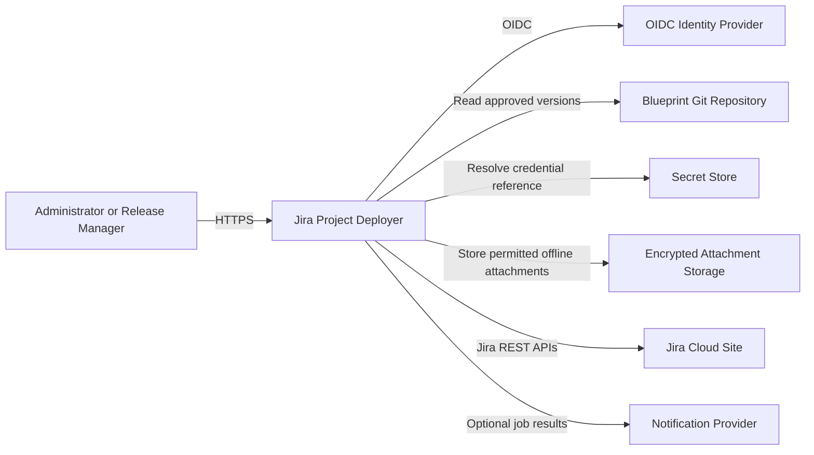
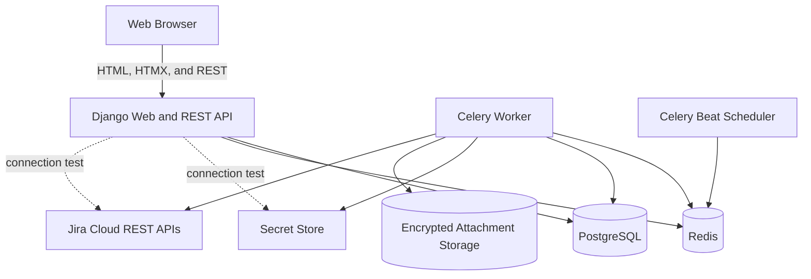

# Jira Project Deployer - Solution Architecture

Status: Proposed v0.1
Date: 2026-08-21
Companion document: [Product Brief](product-brief.md)

## 1. Architecture Summary

Build a Django modular monolith around declarative Jira blueprints. Run the same Django project in three process modes:

- a web process for server-rendered pages and REST endpoints;
- a Celery worker for deployments, validation, test data, and batch jobs;
- a Celery Beat process for schedules.

Use Django 5.2 LTS, Django templates with HTMX for interactive pages, Django REST Framework for the API, PostgreSQL for durable state, audit history, offline structured data, and full-text search, Redis for job delivery and short-lived coordination, an external secret store for Jira credentials, and encrypted Django Storage for offline attachment content.

This is a modular monolith, not a microservice system. Deployment and validation share the same domain model, Jira adapter, planner, and persistence layer. They can be separated later only if measured scale or ownership requires it.

## 2. Context and Boundaries



The application owns plans, execution state, schedules, validation evidence, resource mappings, credential-reference metadata, offline snapshots, and audit events. Jira remains the live system of record for deployed configuration and issues. Git is the preferred source of record for reviewed blueprints. The offline repository is a read-only synchronized projection, not a replacement system of record.

The application does not own Atlassian organizations, billing, Jira site provisioning, user lifecycle, Marketplace application configuration, or Jira backups.

## 3. Runtime Architecture



  ### Django Web Application

Responsibilities:

- select a connection, project, blueprint, and version;
- create or clone blueprint drafts and edit structured or raw YAML/JSON content;
- capture a blueprint draft from capability-approved read-only discovery of a reference Jira project;
- upload a blueprint and navigate location-aware validation findings before import;
- govern OIDC users, group mappings, scoped assignments, sessions, suspensions, and access reviews;
- maintain secret-reference metadata and test staged Jira credentials without displaying active values;
- select Online, Automatic, or Offline data access mode with explicit source and freshness;
- browse and search complete offline snapshots without sending Jira requests;
- browse a configuration tree with dependency indicators;
- render dry-run plans, warnings, conflicts, and unsupported resources;
- approve and start immutable plans;
- monitor jobs using HTMX polling;
- inspect ordered, sanitized Jira API attempts for each job step;
- explore project issue dependencies as synchronized Gantt, radial, network, and matrix views;
- inspect validation and audit results;
- manage test-data packs, batches, and schedules.

Required MVP stack: Python 3.13, Django 5.2 LTS, Django templates, HTMX, minimal JavaScript, and Lucide icons. Use Django forms for page workflows and progressive enhancement so core operations remain usable without a client-side application runtime.

### Django REST API

Responsibilities:

- authenticate users and enforce application roles;
- validate commands and blueprint uploads;
- query application state;
- create plan and job records transactionally;
- publish work only after the database transaction commits;
- expose job progress for browser polling;
- expose health and readiness checks.
- enforce data-source policy so Offline mode cannot invoke the Jira adapter.

Required MVP stack: Django REST Framework for versioned JSON endpoints, Django authentication and permissions for access control, Django ORM and migrations for persistence, `jsonschema` and PyYAML for blueprint parsing, and HTTPX for Jira calls.

### Worker and Scheduler

Responsibilities:

- generate plans using current Jira state;
- execute deployment operations;
- seed and clean test data;
- run validation suites and issue batches;
- test expiring credential candidates by secret reference only;
- run full and incremental offline synchronization with durable checkpoints and manifests;
- apply retries, rate limits, cancellation, and target locks;
- write progress and audit evidence after every step;
- enqueue scheduled jobs.

Required MVP stack: Celery with Redis as broker and `django-celery-beat` for database-managed schedules. PostgreSQL, not Celery result storage, remains the authoritative job record.

### PostgreSQL

Stores application metadata, immutable execution evidence, offline structured entities, snapshot manifests, tombstones, and PostgreSQL full-text search documents. Partial offline snapshots are not queryable as complete. Large raw response bodies are not retained by default. Diagnostics are normalized, bounded in size, and redacted before storage.

### Redis

Provides task delivery, short-lived distributed locks, and rate-limit coordination. Loss of Redis must not lose the authoritative job or plan; pending work can be republished from PostgreSQL.

### Offline Attachment Storage

Uses the Django Storage API with encrypted local storage for development and an encrypted managed object-storage adapter for shared environments. PostgreSQL stores object references, content checksums, snapshot ownership, authorization scope, and retention state. Attachment content is synchronized only when policy permits it and is never served without the same connection and project authorization used for structured offline data.

## 4. Source Layout

The recommended Django project layout is:

```text
manage.py
config/                      Django settings, root URLs, ASGI, Celery
apps/
  accounts/                  Identity, roles, and authorization
  connections/               Jira connections and capabilities
  offline/                   Snapshot sync, manifests, repository search
  blueprints/                Blueprint versions and parsing
  planning/                  Selection, dependency graph, and plans
  executions/                Jobs, steps, locks, and audit
  validation/                Suites, runs, and evidence
  batches/                   Test data, issue batches, and schedules
  web/                       Views, forms, templates, and static assets
domain/                      Framework-light planning and Jira contracts
jira/                        Shared client and resource handlers
blueprints/
  examples/
docs/
tests/
  contract/                  Jira adapter response fixtures
  integration/               Django ORM, Redis, and planner tests
  system/                    Jira sandbox tests
```

Each Django app owns its models, migrations, admin registration, URLs, and tests. Business rules that do not need Django remain in `domain/`; views and Celery tasks call application services instead of implementing Jira logic directly.

### Development and QA Toolset

| Concern | Required MVP tool |
| --- | --- |
| Dependency and command runner | `uv` with `pyproject.toml` and a locked dependency set |
| Web framework | Django 5.2 LTS on Python 3.13 |
| Server-rendered interaction | Django templates and HTMX |
| JSON API | Django REST Framework under `/api/v1/` |
| Database | PostgreSQL through Django ORM and migrations |
| Background work | Celery, Redis, and `django-celery-beat` |
| Jira HTTP | HTTPX through one shared adapter client |
| Offline structured search | PostgreSQL full-text search and trigram indexes |
| Offline attachment content | Django Storage API with encryption-at-rest adapter |
| Blueprint parsing | PyYAML and JSON Schema Draft 2020-12 |
| Automated tests | pytest and pytest-django |
| Static quality | Ruff, mypy, and django-stubs |
| Local services | Docker Compose |

Do not introduce a separate frontend application, ORM, migration system, task framework, or Jira HTTP client without an approved architecture decision.

The current SimpleMind files remain discovery and communication artifacts. A separate conversion tool can assist initial blueprint authoring, but deployment code must consume the versioned blueprint schema rather than `.smmx` XML.

## 5. Core Domain Model

### Blueprint

An immutable, published desired-state document. It contains metadata, parameters, resources, references, test-data packs, validation suites, and batch definitions. Resource identifiers are stable logical IDs, not display names or Jira IDs.

### Blueprint Draft

A mutable authoring copy created empty, cloned from a published version, or parsed from an uploaded YAML/JSON file. It has optimistic concurrency, validation state, and author ownership. A draft cannot be planned or deployed. Publication creates a new immutable blueprint version in one transaction and never updates the source version.

### Blueprint Finding

A structured draft or upload validation result with severity, code, JSON path, line and column when available, message, remediation, and affected logical resource. Findings contain no secret values and can navigate the editor without changing content.

### Resource

A typed deployable unit such as `project`, `customField`, `screen`, `status`, `workflow`, `component`, or `schemeAssignment`. Each resource declares logical dependencies and adapter-specific desired properties.

### Capability

A fact discovered for a Jira connection, for example `project.create`, `workflow.read`, or `workflow.write`. A capability records whether it is supported, unavailable due to permission, unavailable through the API, or not yet implemented by this application.

### Plan

An immutable comparison of one blueprint checksum and parameter set against one observed target state. A plan contains ordered operations and cannot be changed after approval. A state-changing operation must never execute from an unapproved or stale plan.

### Job and Step

A job is an execution request. Steps provide durable checkpoints at resource-operation level. A step has an idempotency key, attempt count, timestamps, result classification, and redacted diagnostic.

### Resource Mapping

Maps a blueprint logical resource ID to a Jira object ID for one connection and target scope. It prevents name-based ambiguity and supports idempotent updates. First deployment may adopt an exact name match only when the resource type and scope prove the match is unique; otherwise planning reports a conflict.

### Validation Result

An evidence item with rule ID, target resource, expected value, observed value, status, severity, message, and remediation hint.

### Jira API Call

A bounded diagnostic record linked to one job step and attempt. It stores method, normalized endpoint, timing, status, retry classification, correlation identifiers, and sanitized request and response excerpts. Credentials, authorization headers, cookies, account data, and configured sensitive fields are never stored.

### Issue Dependency Snapshot

A read-only project-scoped set of normalized Jira issue nodes and typed directed edges. All visual representations consume the same snapshot and filter state. Cycles, hidden nodes, missing dates, and truncation are explicit metadata rather than inferred away.

### Credential Candidate

An expiring secret-store reference staged for one Jira connection. The application stores provider metadata, candidate version, safe keyed fingerprint, actor, expiry, and test result, but never the secret value. Activation atomically changes the connection's active reference only when that exact candidate version has passed the required read-only tests.

### Offline Snapshot

An immutable, connection-scoped synchronization boundary containing normalized Jira entities, tombstones, search documents, attachment-object references, and a completeness manifest. A snapshot is queryable in Offline mode only after every enabled domain reaches a terminal outcome and the snapshot is marked complete. Unsupported and inaccessible domains remain explicit manifest entries.

### Application Identity

A trusted OIDC issuer and subject with display metadata, provider status, synchronized group claims, last identity refresh, last sign-in, suspension state, and session-revocation version. Email is not an identity key. Production identities have no local password.

### Role Assignment

A group mapping or direct exception that grants one application role within global, connection, or project scope. Direct exceptions record owner, reason, start, expiry, and review state. Effective access is computed from active assignments and denied by default.

### Access Review

An immutable review campaign and item snapshot for privileged and direct assignments. Each item records reviewer, certify/modify/revoke decision, reason, timestamp, and resulting action.

### Jira Project Capture

A read-only discovery snapshot and transformation report for one connection and Jira project. Items retain normalized source identity, classification, selected or omitted decision, shared impact, and transformation warning. Draft generation stores provenance separately from portable blueprint content.

## 6. Persistence Model

Initial Django models and tables:

| Table | Purpose |
| --- | --- |
| `users` | External identity and application role mapping |
| `oidc_group_memberships` | Current trusted provider group claims and refresh state |
| `oidc_group_role_mappings` | Provider group to role and scope mappings |
| `role_assignments` | Group-derived or direct role grants, scope, reason, and expiry |
| `application_sessions` | Session metadata, revocation version, and last activity without token values |
| `access_reviews` | Review campaign scope, owner, due date, and status |
| `access_review_items` | Assignment snapshot, reviewer decision, reason, and action |
| `jira_connections` | Site URL, secret reference, auth type, status |
| `jira_credential_versions` | Secret provider reference, version, fingerprint, lifecycle status |
| `jira_credential_tests` | Bounded redacted candidate and active-credential test evidence |
| `connection_capabilities` | Last discovered support and permission facts |
| `blueprints` | Blueprint identity and source metadata |
| `blueprint_versions` | Immutable content, schema version, checksum |
| `blueprint_drafts` | Mutable authoring content, source version, owner, and concurrency version |
| `blueprint_validation_runs` | Draft or upload validation status and content checksum |
| `blueprint_findings` | Location-aware, redacted validation findings |
| `jira_capture_runs` | Reference connection/project, snapshot boundary, actor, and status |
| `jira_capture_items` | Normalized source resource, classification, decision, and warning |
| `blueprint_capture_provenance` | Draft/version link to source snapshot and selected/omitted resources |
| `resource_mappings` | Logical resource ID to Jira object ID |
| `plans` | Target, parameters, selection, checksum, approval state |
| `plan_operations` | Ordered desired action for each resource |
| `jobs` | Execution state, type, actor, target, correlation ID |
| `job_steps` | Durable checkpoint and redacted outcome |
| `job_api_calls` | Ordered, bounded, sanitized Jira request and response diagnostics |
| `validation_runs` | Suite execution and summary |
| `validation_results` | Rule-level evidence |
| `schedules` | Time zone, trigger, command, enabled state |
| `audit_events` | Append-only security and domain event trail |
| `offline_sync_runs` | Full or incremental sync state and durable checkpoints |
| `offline_snapshots` | Immutable snapshot boundary, freshness, completeness, and policy |
| `offline_snapshot_manifests` | Entity counts, API coverage, omissions, failures, and attachment policy |
| `offline_entities` | Normalized structured Jira entities scoped to a snapshot |
| `offline_search_documents` | Permission-scoped PostgreSQL full-text search records |
| `offline_attachment_objects` | Encrypted object references, checksums, scope, and retention state |

Use Django model constraints for job idempotency keys and resource mappings and atomic transactions for state changes. Use explicit version fields for optimistic concurrency on mutable records. Audit rows are append-only through application services and immutable in Django admin.

## 7. Jira Adapter

Jira behavior must be behind an interface rather than spread across API handlers and tasks.

```python
class JiraResourceHandler(Protocol):
    resource_type: str

    async def discover(self, context: TargetContext) -> ObservedResources: ...
    def compare(self, desired: Resource, observed: ObservedResource | None) -> Change: ...
    async def apply(self, operation: Operation, context: ExecutionContext) -> ApplyResult: ...
    async def verify(self, operation: Operation, context: ExecutionContext) -> Verification: ...
    async def capabilities(self, connection: JiraConnection) -> list[Capability]: ...
```

Handlers are registered by resource type. Shared Jira HTTP behavior belongs in one client:

- authentication and credential resolution;
- Atlassian pagination conventions;
- bounded retries for `429` and transient `5xx` responses;
- `Retry-After` handling and adaptive rate limits;
- request correlation and structured redacted diagnostics;
- consistent error classification;
- response normalization and contract fixtures.

Jira Cloud administration APIs are not uniform across all configuration types and permissions. Capability discovery is therefore part of the product, not an implementation detail. Unsupported actions appear in a plan and validation report. They are never silently ignored.

## 8. Planning and Dependency Resolution

Resources form a directed acyclic graph. An edge `A -> B` means B requires A to exist first.

Typical dependencies include:

- a field context requires its custom field;
- a screen field placement requires both a screen and a field;
- a workflow requires statuses and any fields referenced by conditions or validators;
- an issue type scheme requires its issue types;
- a workflow scheme requires workflows and issue types;
- a project scheme assignment requires the project and scheme;
- test data requires the project configuration and referenced issue types and fields.

Planning steps:

1. Parse and schema-validate the blueprint.
2. Resolve non-secret parameters and reject missing values.
3. Expand the requested selection with transitive dependencies.
4. Detect cycles, dangling references, and mutually exclusive resources.
5. Discover target capabilities, permissions, current state, and resource mappings.
6. Normalize desired and observed values to remove irrelevant Jira ordering and defaults.
7. Classify each resource as create, update, unchanged, conflict, unsupported, or blocked.
8. Topologically order executable operations and attach preconditions.
9. Persist the immutable plan, blueprint checksum, parameter hash, and target-state fingerprint.

Secrets are resolved only by the worker at execution time. Secret values do not appear in the plan, parameter hash, logs, or exports.

## 9. Execution Model

1. Authorize the actor for the approved plan and target environment.
2. Acquire a lock for the Jira connection and project key.
3. Verify the plan checksum, connection identity, capabilities, and staleness preconditions.
4. Execute operations in dependency order.
5. Before each mutation, check cancellation and the durable step checkpoint.
6. Apply the operation with its idempotency key and expected observed state.
7. Read the resource back from Jira and verify the intended result.
8. Save the resource mapping, step result, and audit event in one database transaction.
9. Apply bounded retry only to classified transient failures.
10. Stop dependent operations after a permanent failure; independent completed work remains recorded.
11. Run selected post-deployment validation and release the target lock.

MVP does not claim general rollback. Jira configuration operations are not uniformly reversible or transactional. On failure, the system stops, preserves evidence, identifies completed changes, and offers a corrected forward plan. Test-data cleanup is the supported compensating action.

## 10. Test-Data Model

Test-data packs use logical issue IDs so links can be resolved after Jira keys are assigned. A two-phase process creates issues first and then adds links, comments, and relationships.

Each created issue receives:

- a dedicated application label;
- an entity property containing blueprint ID, pack ID, and job ID;
- an audit mapping from logical ID to Jira issue ID and key.

Cleanup queries both the entity property and stored mapping, shows a preview, and refuses issues that do not match the originating connection, project, pack, and run.

## 11. Batch Safety

Issue batches are command definitions, not arbitrary scripts. Each command has an allow-listed action schema, JQL, preview result, maximum issue count, page size, rate limit, retry policy, and stop threshold.

Execution safeguards:

- run Jira's JQL validation before approval;
- show total count and a bounded sample;
- reject a count over the configured limit;
- freeze the command and approval as an immutable plan;
- record per-issue outcomes without storing sensitive issue content unnecessarily;
- treat field updates and transitions as idempotent where Jira state permits;
- stop when the permanent-failure percentage crosses the approved threshold.

## 12. API Surface

Initial Django REST Framework resources under the `/api/v1/` namespace:

```text
GET/POST        /api/v1/connections/
POST            /api/v1/connections/{id}/test/
POST            /api/v1/connections/{id}/discover-capabilities/
GET             /api/v1/connections/{id}/credential-metadata/
POST            /api/v1/connections/{id}/credential-candidates/
POST            /api/v1/connections/{id}/credential-candidates/{candidate}/test/
POST            /api/v1/connections/{id}/credential-candidates/{candidate}/activate/
DELETE          /api/v1/connections/{id}/credential-candidates/{candidate}/
GET             /api/v1/users/
GET             /api/v1/users/{id}/
POST            /api/v1/users/{id}/suspend/
POST            /api/v1/users/{id}/restore/
GET             /api/v1/users/{id}/sessions/
POST            /api/v1/users/{id}/sessions/revoke/
GET/POST        /api/v1/group-role-mappings/
GET/PATCH/DELETE /api/v1/group-role-mappings/{id}/
GET/POST        /api/v1/role-assignments/
GET/PATCH/DELETE /api/v1/role-assignments/{id}/
GET/POST        /api/v1/access-reviews/
POST            /api/v1/access-reviews/{review}/items/{item}/decide/
GET/POST        /api/v1/blueprints/
GET             /api/v1/blueprints/{id}/versions/{version}/
POST            /api/v1/blueprints/validate/
GET/POST        /api/v1/blueprint-drafts/
GET/PATCH/DELETE /api/v1/blueprint-drafts/{id}/
POST            /api/v1/blueprint-drafts/{id}/validate/
POST            /api/v1/blueprint-drafts/{id}/publish/
POST            /api/v1/blueprint-uploads/validate/
POST            /api/v1/blueprint-captures/
GET             /api/v1/blueprint-captures/{id}/
PATCH           /api/v1/blueprint-captures/{id}/items/
POST            /api/v1/blueprint-captures/{id}/generate-draft/
POST            /api/v1/plans/
GET             /api/v1/plans/{id}/
POST            /api/v1/plans/{id}/approve/
POST            /api/v1/plans/{id}/execute/
GET             /api/v1/jobs/{id}/
POST            /api/v1/jobs/{id}/cancel/
POST            /api/v1/jobs/{id}/retry/
GET             /api/v1/jobs/{id}/api-calls/
POST            /api/v1/validation-runs/
GET             /api/v1/validation-runs/{id}/
POST            /api/v1/test-data/plans/
POST            /api/v1/batch-plans/
GET/POST         /api/v1/schedules/
GET             /api/v1/audit-events/
GET             /api/v1/projects/{id}/issue-dependencies/
GET/POST        /api/v1/offline-repositories/
POST            /api/v1/offline-repositories/{id}/sync/
GET             /api/v1/offline-repositories/{id}/sync-runs/{run}/
GET             /api/v1/offline-repositories/{id}/snapshots/
GET             /api/v1/offline-repositories/{id}/snapshots/{snapshot}/manifest/
GET             /api/v1/offline-repositories/{id}/search/
GET             /api/v1/offline-repositories/{id}/entities/{entity}/
PATCH           /api/v1/offline-repositories/{id}/policy/
DELETE          /api/v1/offline-repositories/{id}/
```

State-changing requests accept an idempotency key. API errors use a stable problem-details format with a correlation ID and do not expose Jira credentials or raw authorization headers. Django page URLs are separate from `/api/v1/` and use named URL patterns.

## 13. Security Architecture

### Authentication and Authorization

- Authenticate users through OIDC.
- Identify users by trusted issuer plus subject; treat email and display name as mutable metadata.
- Map identity-provider groups to `viewer`, `operator`, `approver`, and `administrator` roles with explicit global, connection, or project scope.
- Prefer group-derived access; require owner, reason, start, optional expiry, and review for direct exceptions.
- Deny by default and calculate effective access from active, non-expired, non-suspended assignments on every protected request.
- Store no local production password and do not create, disable, or modify Atlassian accounts.
- Revoke application sessions after suspension, provider disablement, and explicit administrator action within a configured bound.
- Protect the final active global administrator path from self-removal, expiry, or suspension.
- Review privileged and direct assignments periodically and audit every mapping, assignment, session, suspension, and review decision.
- Separate plan creation, approval, and execution permissions so production can require two-person approval later.
- Authorize every command by target connection and environment, not only by route.

### Jira Credentials

- Store only a secret reference in PostgreSQL.
- Resolve the value from an external secret store at execution time.
- Accept candidate values only through TLS-protected, CSRF-protected administrator requests with request-body logging disabled.
- Write candidate values directly to the external secret store; do not place them in Django models, sessions, browser storage, Celery payloads, URLs, diagnostics, or audit.
- Give staged candidates a bounded lifetime and test them through their secret reference using read-only capability-approved endpoints.
- Require successful testing and explicit confirmation before atomic activation; failed testing leaves the active reference unchanged.
- Display only provider, reference, provider version, safe keyed fingerprint, status, actor, and timestamps.
- Use a dedicated Jira automation identity with least privilege.
- Prefer OAuth where required scopes support the operation; support an API-token-backed service identity for controlled internal deployments.
- Never place tokens in browser storage, task payloads, URLs, logs, or exports.

### Application Controls

- Enforce TLS and secure cookie settings.
- Use Django's CSRF middleware for form and session-authenticated API mutations.
- Validate and size-limit blueprint uploads.
- Decode uploads using an explicit supported encoding, reject unsupported extensions, and parse them without executing templates or expressions.
- Redact authorization headers, tokens, account data, and configured sensitive fields.
- Record authentication, approval, credential-reference, schedule, and execution events in the audit trail.
- Enforce Offline mode at the Jira-client policy boundary, not only in the UI.
- Encrypt offline structured and attachment data at rest and authorize every browse/search request by current connection and project access.
- Treat snapshot manifests, source, completeness, omissions, and freshness as mandatory user-visible data.
- Never queue Jira mutations while Offline mode is active.
- Scan dependencies and container images in CI.

## 14. Observability

Use one correlation ID across browser request, plan, job, worker step, and Jira request. Emit structured logs with IDs rather than full Jira payloads.

Key metrics:

- jobs by type, state, connection, and duration;
- plan operations by classification and resource type;
- Jira request latency, status, retry, and rate-limit wait;
- queue depth and oldest queued job age;
- validation pass, warning, fail, and drift counts;
- scheduler lateness and worker heartbeat age.
- credential candidate test outcomes and activation failures without secret material;
- offline sync lag, checkpoint age, entity counts, omissions, snapshot completeness, index age, storage quota, and local search latency.

Health endpoints distinguish liveness from readiness. Readiness checks PostgreSQL and Redis; Jira availability is reported per connection and does not make the whole application unready.

## 15. Deployment Topology

Package the Django project as one container image with separate ASGI web, Celery worker, and Celery Beat commands. Collect and serve static assets through the hosting platform or WhiteNoise. Local development uses Docker Compose with PostgreSQL and Redis.

For a shared environment, run:

- two Django ASGI replicas behind an HTTPS ingress;
- one or more workers with controlled concurrency;
- exactly one scheduler replica;
- managed PostgreSQL, managed Redis, an external secret store, and encrypted object storage;
- centralized logs and metrics.

The design is cloud-neutral until hosting constraints are known. Infrastructure-specific identity, secret-store, database, and ingress choices should be recorded in a later deployment decision.

## 16. Test Strategy

- Unit tests: blueprint parsing, normalization, dependency graph, diff classification, policy, and redaction with `pytest`.
- Contract tests: Jira API requests and normalized responses using sanitized fixtures for every handler.
- Integration tests: Django ORM models, migrations, PostgreSQL constraints, Redis task publication, locking, retries, and resumption with `pytest-django`.
- Component tests: Django views, forms, DRF authorization, and Celery execution with a fake Jira adapter.
- Visualization tests: one dependency snapshot produces consistent filters, selections, relationship counts, and accessible detail across every representation.
- Credential tests: candidate expiry, test classifications, atomic activation, rollback preservation, audit, and seeded-secret scans.
- Identity tests: issuer/subject linking, group refresh, scope isolation, direct exception expiry, last-administrator protection, suspension, session revocation, and access review.
- Capture tests: read-only Jira discovery, classification, deterministic logical IDs, parameterization, provenance, shared impact, omissions, and editor validation.
- Offline tests: full and incremental sync, tombstones, partial snapshot isolation, local-only network denial, search authorization, encryption, retention, purge, backup, and restore.
- System tests: nightly sandbox deployment, idempotent rerun, deliberate drift, test-data cleanup, and representative issue batch.
- Security tests: role boundaries, upload limits, secret redaction, cross-target authorization, and audit completeness.

No production Jira site is used for automated tests.

## 17. Key Decisions and Risks

| Decision or risk | Position or mitigation |
| --- | --- |
| Public Jira APIs do not cover every administrative action uniformly | Capability discovery, explicit unsupported plan items, and optional future extension adapter |
| Jira configuration is partly global and shared across projects | Scope resources explicitly, require higher approval for shared updates, and default to reuse rather than mutation |
| Names may be duplicated or changed | Stable logical IDs plus persisted Jira ID mappings; ambiguous adoption is a conflict |
| Jira rate limits and transient failures | Central client, adaptive throttling, bounded retries, durable checkpoints |
| Partial deployments can produce invalid configuration | Dependency graph expansion and blocking static validation |
| Generic rollback is unsafe | Non-destructive MVP, read-back verification, halt with evidence, corrected forward plan |
| Test cleanup could remove user data | Run markers, stored mappings, connection/project checks, and cleanup preview |
| Scheduler could overlap writes | Per-target lock and configurable overlap policy |
| Blueprint secrets could leak | Secret references only, execution-time resolution, redaction tests |
| A bad credential rotation could break working access | Stage in secret store, test exact candidate version, explicitly activate, preserve active reference on failure |
| Offline data can be stale or incomplete | Immutable manifests, visible source/freshness, complete-snapshot gating, no silent fallback |
| Offline data can outlive Jira permissions | Current application authorization on every query, connection disable controls, retention and purge policy, audited access |
| Full Jira replication can exceed storage limits | Selected scopes, incremental sync, quotas, retention, attachment policy, encrypted object storage |
| Users may treat offline data as live or queue writes | Persistent Offline labeling, Jira-client network deny, strictly read-only repository, no mutation queue |
| Email-based identity linking could grant the wrong person access | Trusted issuer plus immutable subject is the identity key; email changes are metadata updates |
| Direct exceptions can accumulate privilege | Group-first policy, owner and reason, bounded expiry, access reviews, stale-access reporting |
| User suspension could remove the last administrator | Transactional final-administrator guard and separate emergency-access procedure |
| Captured Jira configuration can include shared or unsupported resources | Pre-draft classification, explicit shared decisions, transformation warnings, normal blueprint validation |
| Jira IDs make captured blueprints non-portable | Deterministic logical IDs and parameters; source Jira IDs stay in provenance/mapping metadata |

## 18. Architecture Decisions to Revisit

These do not block the MVP domain implementation, but must be decided before a shared environment is deployed:

- hosting platform and external secret-store implementation;
- organization identity provider and group-to-role mapping;
- Jira Cloud authentication method and approved scopes;
- Git provider and blueprint approval workflow;
- retention periods for plans, diagnostics, issue-level batch outcomes, and audit evidence;
- notification channels and production approval policy.

## 19. Agent Delivery Model

Implementation follows the canonical issues in [`backlog/`](../backlog/README.md). A Solution Manager advances one unblocked issue at a time and orchestrates a mandatory Senior Developer and Senior QA tandem. It may also invoke a Senior UX Specialist for user-experience changes, a Senior Security Specialist for trust-boundary or sensitive-data changes, and a Senior Data Modeler and Database Specialist for model, migration, PostgreSQL, transaction, retention, or recovery changes. All delegated specialists use the `gemini-flash 3.7` model. The Developer supplies implementation evidence, QA supplies independent verification, optional specialists verify their findings, and the Solution Manager alone accepts the issue as done.